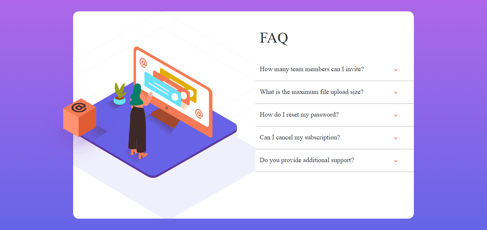

# Frontend Mentor - FAQ Accordion Card Component solution

This is a solution to the [FAQ Accordion Card Component challenge on Frontend Mentor](https://www.frontendmentor.io/challenges/faq-accordion-card-XlyjD0Oam). Frontend Mentor challenges help you improve your coding skills by building realistic projects. 

## Table of contents

- [Overview](#overview)
  - [The challenge](#the-challenge)
  - [Screenshot](#screenshot)
  - [Links](#links)
- [My process](#my-process)
  - [Built with](#built-with)
  - [What I learned](#what-i-learned)
  - [Continued development](#continued-development)
- [Author](#author)

## Overview

### The challenge

Users should be able to:

- View the optimal layout depending on their device's screen size
- Hide/Show the answer to a question when the question is clicked

### Screenshot

### Links

- Solution URL: [Github](https://github.com/RuanHeleno/FrontEndMentor)
- Live Site URL: [Demo](https://frontendmentorchallengesrh.netlify.app)

## My process

### Built with

- Semantic HTML5 markup
- CSS3 custom properties
- [Bootstrap5](https://getbootstrap.com) - For flexbox

### What I learned

- How to work with Bootstrap5 flexbox
- How to align multiple images

### Continued development

- Layout
- Flexbox
- Semantic
- Imagens alignment

## Author

- [Portfolio](https://ruanheleno.github.io)
- [Github](https://www.github.com/RuanHeleno)
- [LinkedIn](https://www.linkedin.com/in/ruanheleno/)
- [Frontend Mentor](https://www.frontendmentor.io/profile/RuanHeleno)