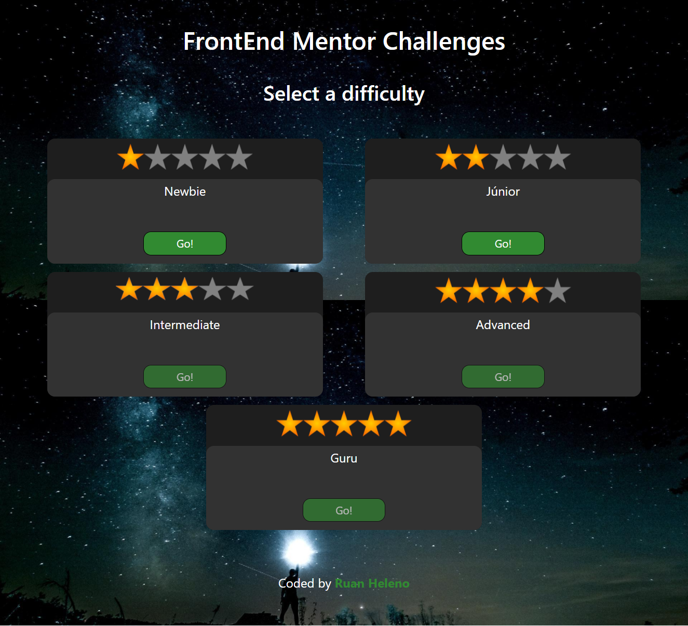

# Frontend Mentor Challenges

This is a homepage to all challenges from FrontEnd Mentor made by me.

## Table of contents

- [Overview](#overview)
  - [Screenshot](#screenshot)
  - [Links](#links)
- [My process](#my-process)
  - [Built with](#built-with)
- [Author](#author)

## Overview

### Screenshot

### Links

- Live Site URL: [Demo](https://frontendmentorchallengesrh.netlify.app)

## My process

### Built with

- Semantic HTML5 markup
- CSS3 custom properties
- [Bootstrap5](https://getbootstrap.com) - For flexbox

### What I learned

- How to work with Bootstrap5 flexbox
- How to work with flexbox and container at same time

## Author

- Portfolio - [Ruan Heleno](ruanheleno.github.io)
- LinkedIn - [RuanHeleno](https://www.linkedin.com/in/ruanheleno/)
- Frontend Mentor - [@RuanHeleno](https://www.frontendmentor.io/profile/RuanHeleno)