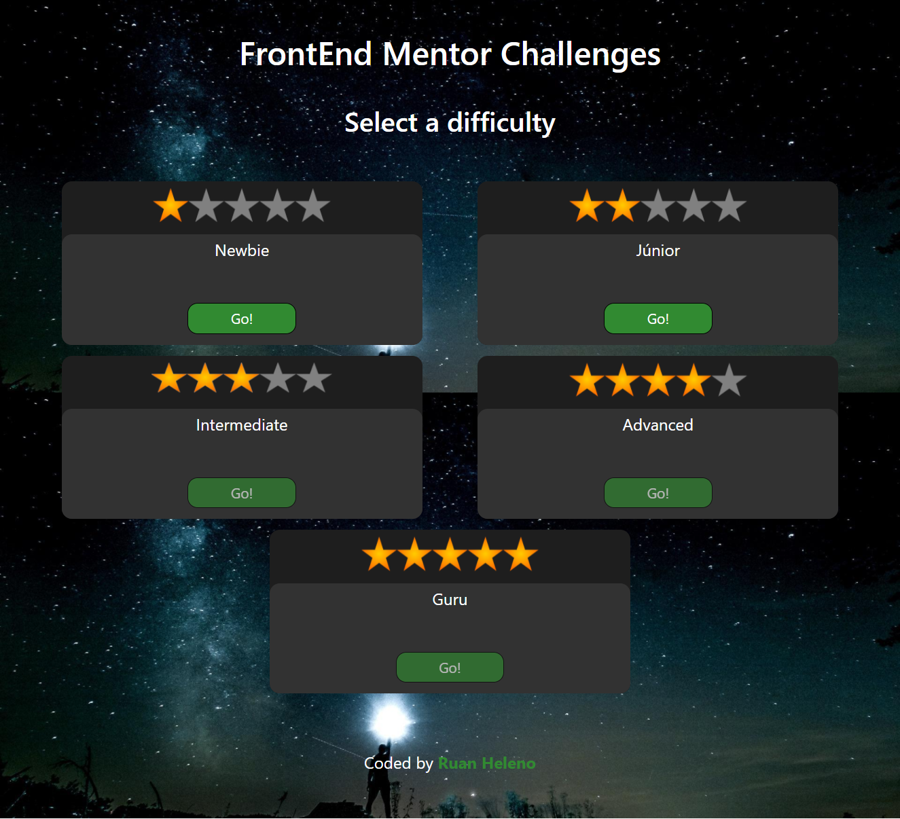

# Frontend Mentor Challenges

This is a homepage to all challenges from FrontEnd Mentor made by me.

## Table of contents

- [Overview](#overview)
  - [Screenshot](#screenshot)
  - [Links](#links)
- [My process](#my-process)
  - [Built with](#built-with)
- [Author](#author)

## Overview

### Screenshot

### Links

- Live Site URL: [Demo](https://frontendmentorchallengesrh.netlify.app)

## My process

### Built with

- [HTML5](https://www.w3schools.com/html/)
- [CSS3](https://developer.mozilla.org/pt-BR/docs/Web/CSS)
- [Bootstrap5](https://getbootstrap.com)

## Author

- [Portfolio](https://ruanheleno.github.io)
- [LinkedIn](https://www.linkedin.com/in/ruanheleno/)
- [Frontend Mentor](https://www.frontendmentor.io/profile/RuanHeleno)